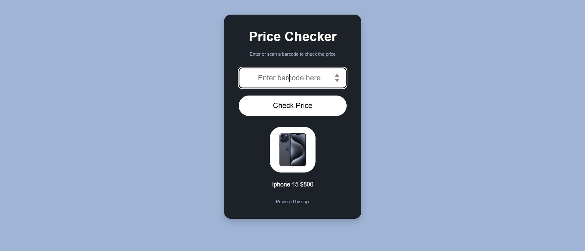
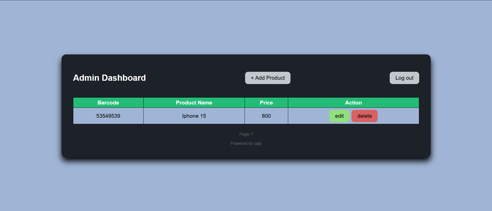

# 🏪 Simple Price Checker POS

A lightweight Price Checker System inspired by kiosks in supermarkets.  
Customers can scan a product barcode and instantly see its name, price, and image.  
Includes an Admin Panel for managing products using a MySQL database.  

---

## ✨ Features

✅ Barcode Scanner Input – plug in a barcode scanner and scan products directly  
🖼️ Product Display – shows name, price, and image instantly  
🛠️ Admin Panel – add, update, and delete products  
🔗 Smart Sync – renaming a product also renames its image file automatically  
🗄️ Database Integration – all product info is stored in MySQL  

---

## 🛠️ Tech Stack

🌐 Frontend: HTML, CSS, JavaScript  
⚙️ Backend: PHP  
🗄️ Database: MySQL  

---

## Screenshots

🏷️ Price Checker  

🔐 Admin Panel  

📊 Dashboard Panel  

---

## 🚀 Installation Guide

1. Clone the repository  
   git clone https://github.com/cajx-it/Simple-Price-Checker-POS.git  

2. Set up the database  
   - Import the SQL file into your MySQL server  
   - Update database settings in config.php  

3. Deploy the project  
   - Copy the folder to your server root (htdocs for XAMPP, www for WAMP)  

4. Run the app  
   - Start Apache and MySQL in XAMPP/WAMP/LAMP  
   - Open http://localhost/Simple-Price-Checker-POS in your browser  

---

## 📖 Usage

👤 Customers  
- Scan a product barcode  
- Instantly see the name, price, and image  

🛡️ Admins  
- Log in to the Admin Panel  
- Add, update, or delete products  
- Images auto-update when product names change  

---

## 🙌 Acknowledgments

Inspired by store price checker kiosks 🛒  
Built with ❤️ using PHP, MySQL, and a barcode scanner  
